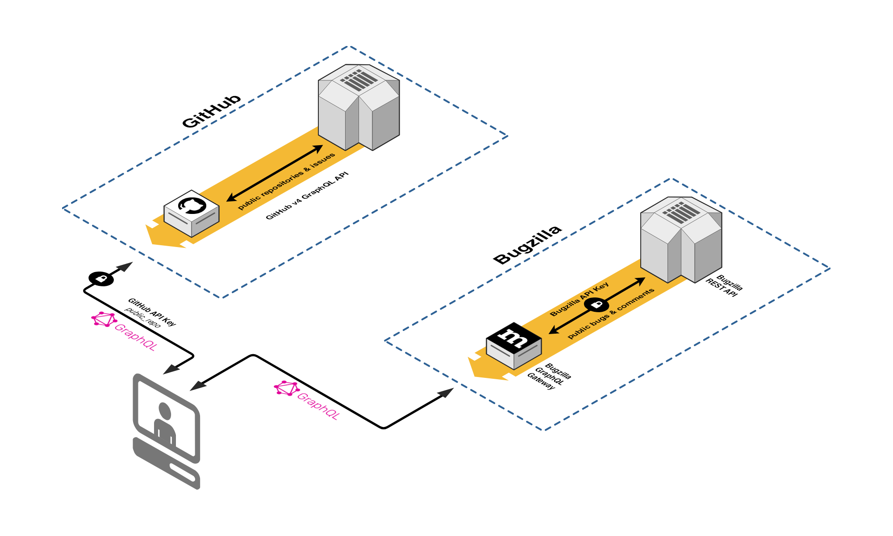

# Codetribute

[![Build Status][travis-image]][travis-url]
[![Known Vulnerabilities][snyk-image]][snyk-url]

Codetribute is a site that guides contributors to
their first contribution. It helps new contributors 
find a project they want to work with, learn about 
that project, and then find a task that is suitable 
to their skills and interests and not already assigned to 
someone else.

## Development

### Prerequisites

- Node version v8+
- [Yarn](https://www.npmjs.com/package/yarn)

### Building

First, fork this repository to another GitHub account (your account).
Then you can clone and install:

```
git clone https://github.com/<YOUR_ACCOUNT>/codetribute.git
cd codetribute
yarn
```

### Web Server
Codetribute relies on two servers, namely, GitHub’s GraphQL API v4 (managed by GitHub) and
[bugzilla-graphql-gateway](http://github.com/mozilla-frontend-infra/bugzilla-graphql-gateway). 
The latter is required to perform queries to the Bugzilla API. For a local setup, clone the repo 
and follow the instruction for starting it prior to launching this application. You will need to
launch the bugzilla-graphql-gateway in a terminal instance separate from this application in order 
to run both simultaneously.

### Environment variables

To get started with local development, create a file in the root of the repo named
`.env` with the following content. You can also set the variables in your shell environment.

```bash
GITHUB_PERSONAL_API_TOKEN=<your_github_api_token>
BUGZILLA_ENDPOINT=http://localhost:3090
```

Generate a GitHub personal access token [here](https://github.com/settings/tokens). When prompted
about scopes, access to public repositories is the only one required.

### Code Organization

- `src/`: source code
- `src/App`: top-level component
- `src/components`: generic components that can be used in any view (not view-specific)

### Tasks and Configuration

Building this project uses [Neutrino](https://github.com/mozilla-neutrino/neutrino-dev),
[neutrino-preset-mozilla-frontend-infra](https://github.com/mozilla-frontend-infra/neutrino-preset-mozilla-frontend-infra)

### Testing changes

Install npm dependencies and start it up:

- `yarn`
- `yarn start`

This will start a local development server on port 5000 (http://localhost:5000).

Additionally if you wish to query the Bugzilla GraphQL API locally instead of
the production instance, you'll need to clone and run
[mozilla-frontend-infra/bugzilla-graphql-gateway](https://github.com/mozilla-frontend-infra/bugzilla-graphql-gateway).

## Adding a project

Codetribute can read from both GitHub and Bugzilla. Regarding the latter, only bugs with the `good-first-bug` keyword will appear in the list.
Mentored bugs are not yet supported, see [issue 32](https://github.com/mozilla-frontend-infra/codetribute/issues/32) for details.
To add a new entry to the site, create a file `<project-name>.yml` in `src/data` using the [template example](#template-example) as the initial setup. 
For inspiration, check out the [Taskcluster](https://github.com/mozilla-frontend-infra/codetribute/blob/master/src/data/taskcluster.yaml) yaml file.

### Template Example

```yaml
name: <Project Name>
summary: A short summary of the project
introduction: |
  ## About <Project Name>

  <A short summary to capture the curiosity of interested contributors>

  ## Who Works on <Project Name>?

  <Give a contributor an idea of what kind of people they'll meet>

  ## How Do I Get Started?

  <General advice - tutorials to learn about the project, development setup, repo to clone if there is only one>

  ### How Do I Write the Code?

  <Summary of the development and patch-submission process -- pull requests? patches on bugzilla? tests?>

  ## How Do I Get Help?

  <Suggestions for how, and when, to ask for help -- mailing lists, irc channels, bug or issue comments, etc.>

products:
- <Bugzilla Product>
- <Bugzilla Product>: ['<Bugzilla Component 1>', '<Bugzilla Component 2>']
repositories:
- <Organization Name>/<Repository Name> : <Github Label>
- <Organization Name>/<Repository Name> : ['<Github Label 1>', '<Github Label 2>']

```
_Note: The `summary` and `introduction` fields are to be rendered as markdown, allowing for bullet points, links and other simple formatting._

### Best Practices

Below is information about how to get a bug or issue appear on the site.

#### GitHub

Codetribute will read the `repositories` field from the yaml file and will take extract the issues that match the repository labels.

_Example: Display servo issues tagged with the label *E-easy*_

```yaml
repositories: 
 - servo/servo: E-easy
```

_Example: Display telemetry-dashboard issues tagged with either the *mentored* or *good first issue* label_

```yaml
repositories:
 - mozilla/telemetry-dashboard: ['mentored', 'good first issue']
```

#### Bugzilla

Codetribute will read the `products` field from the yaml file and will extract bugs with keyword `good-first-bug`. Here are some ways to display bugs on the site.

_Example: Display all Taskcluster bugs with keyword *good-first-bug*_

```yaml
products: 
 - Taskcluster
```

_Example: Display Taskcluster bugs that are under either the Tools component or the Queue component with keyword *good-first-bug*_

```yaml
products:
 - Taskcluster: ['Tools', 'Queue']
```

## Data Flow



## Contributing

This project welcomes contributors. If you are interested, please feel free to
join [the mailing list](https://mail.mozilla.org/listinfo/bugsahoy-devel)

[snyk-image]: https://snyk.io/test/github/mozilla-frontend-infra/codetribute/badge.svg
[snyk-url]: https://snyk.io/test/github/mozilla-frontend-infra/codetribute?targetFile=package.json
[travis-image]: https://travis-ci.com/mozilla-frontend-infra/codetribute.svg?branch=master
[travis-url]: https://travis-ci.com/mozilla-frontend-infra/codetribute
